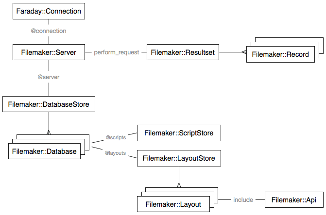

# Filemaker

[](https://travis-ci.org/mech/filemaker-ruby)

A Ruby wrapper to FileMaker XML API.



## Installation

Put this in your Gemfile and you are ready to go:

```
gem 'filemaker'
```

## Initializing the Server

Ensure you have Web Publishing Engine (XML Publishing) enabled. Please turn on SSL also or credential will not be protected. Remember to also set the "Extended Privileges" to this keyword: `fmxml`.

Configuration for initializing a server:

* `host` - IP or hostname
* `ssl` - `{ verify: false }` if you are using FileMaker's unsigned certificate. You can also pass a hash which will be forwarded to Faraday directly like `ssl: { client_cert: '', client_key: '', ca_file: '', ca_path: '/path/to/certs', cert_store: '' }`. See [Setting up SSL certificates](https://github.com/lostisland/faraday/wiki/Setting-up-SSL-certificates)
* `account` - Please use `ENV` variable like `ENV['FILEMAKER_ACCOUNT']`
* `password` - Please use `ENV` variable like `ENV['FILEMAKER_PASSWORD']`

```ruby
server = Filemaker::Server.new do |config|
  config.host         = 'localhost'
  config.account_name = ENV['FILEMAKER_ACCOUNT_NAME']
  config.password     = ENV['FILEMAKER_PASSWORD']
  config.ssl          = { verify: false }
  config.log          = :curl
end

server.databases.all                   # Using -dbnames
server.database['candidates'].layouts  # Using -layoutnames and -db=candidates

api = server.db['candidates'].lay['profile']
api = server.db['candidates']['profile']
api = server.database['candidates'].layout['profile']
```

Once you are able to grab the `api`, you are golden and can make request to read/write to FileMaker API.

## Using the API

`Filemaker::Api::QueryCommands` is the main modules to use the API.

* `api.find()` for `-find`
* `api.findany()` for `-findany`
* `api.findquery()` for `-findquery`
* `api.new()` for `-new`
* `api.edit()` for `-edit`
* `api.delete()` for `-delete`
* `api.dup()` for `-dup`
* `api.view()` for `-view`

Most API will be smart enough to reject invalid query parameters if passed in incorrectly.

## Using Filemaker::Model

If you want ActiveModel-like access with a decent query DSL like `where`, `find`, `all`, you can include `Filemaker::Model` to your model. Your Rails form will work as well as JSON serialization.

```ruby
class Job
  include Filemaker::Model

  database :jobs
  layout :job

  # Taken from filemaker.yml config file, default to :default
  # Only use registry if you have multiple FileMaker server you want to connect
  registry :read_slave

  string   :job_id, fm_name: 'JobOrderID', id: true
  string   :title, :requirements
  datetime :created_at
  datetime :published_at, fm_name: 'ModifiedDate'
  money    :salary

  validates :title, presence: true

  has_many :applicants
end
```

```yml
# filemaker.yml

development:
  default:
    host: localhost
    account_name: ENV['FILEMAKER_ACCOUNT_NAME']
    password: ENV['FILEMAKER_PASSWORD']
    ssl: true
    log: :curl

  read_slave:
    host: ...
    ssl: { verify: false }

production:
  default:
    host: example.com
    ssl: { ca_path: '/secret/path' }
```

## Query DSL

### Using -find

```ruby
Model.where(gender: 'male', age: '< 50')      # Default -lop=and
Model.where(gender: 'male').or(age: '< 50')   # -lop=or
Model.where(gender: 'male').not(age: 40)   # age.op=neq

# Supply a block to configure additional options like -script, -script.prefind, -lay.response, etc
Model.where(gender: 'male').or(age: '< 50') do |option|
  option[:script] = ['RemoveDuplicates', 20]
end

Model.where(gender: 'male').or(name: 'Lee').not(age: '=40')

# Comparison operator

Model.equals(candidate_id: '123')         # { candidate_id: '=123' }
Model.contains(name: 'Chong')             # { name: '*Chong*' }
Model.begins_with(salary: '2000...4000')  # ??
Model.ends_with(name: 'Yong')             # { name: '*Yong' }
Model.gt(age: 20)
Model.gte(age: 20)
Model.lt(age: 20)
Model.lte(age: 20)
Model.not(name: 'Bob')
```

### Using -findquery

OR broadens the found set and AND narrows it

```ruby
# (q0);(q1)
# (Singapore) OR (Malaysia)
Model.in(nationality: %w(Singapore Malaysia))

# (q0,q1)
# Essentially the same as:
# Model.where(nationality: 'Singapore', age: 30)
Model.in(nationality: 'Singapore', age: 30)

# (q0);(q1);(q2);(q3)
Model.in({ nationality: %w(Singapore Malaysia) }, { age: [20, 30] })

# (q0,q2);(q1,q2)
# (Singapore AND male) OR (Malaysia AND male)
Model.in(nationality: %w(Singapore Malaysia), gender: 'male')

# !(q0);!(q1)
# NOT(Singapore) OR NOT(Malaysia)
Model.not_in(nationality: %w(Singapore Malaysia))

# !(q0,q1)
Model.not_in(name: 'Lee', age: '< 40')

# !(q0);!(q1)
# Must be within an array of hashes
Model.not_in([{ name: 'Lee' }, { age: '< 40' }])

# (q0);(q1);!(q2,q3)
Model.in(nationality: %w(Singapore Malaysia)).not_in(name: 'Lee', age: '< 40')
```

- [ ] Please test the above query with real data to ensure correctness!
- [ ] Please test the comparison operators with keyword as well as applied to value.
- [ ] Test serialization of BigDecimal and other types.

## Credits

This project is heavily inspired by the following Filemaker Ruby effort and several other ORM gems.

* [Rfm](https://github.com/lardawge/rfm)
* [ginjo/rfm](https://github.com/ginjo/rfm)
* [mongoid](https://github.com/mongoid/mongoid)
* [origin](https://github.com/mongoid/origin)
* [elasticsearch-ruby](https://github.com/elasticsearch/elasticsearch-ruby)

## Contributing

We welcome pull request with specs.

1. Fork it ( https://github.com/mech/filemaker-ruby/fork )
2. Create your feature branch (`git checkout -b my-new-feature`)
3. Commit your changes (`git commit -am 'Add some feature'`)
4. Push to the branch (`git push origin my-new-feature`)
5. Create a new Pull Request

Do run `rubocop -D -f simple` before committing.
